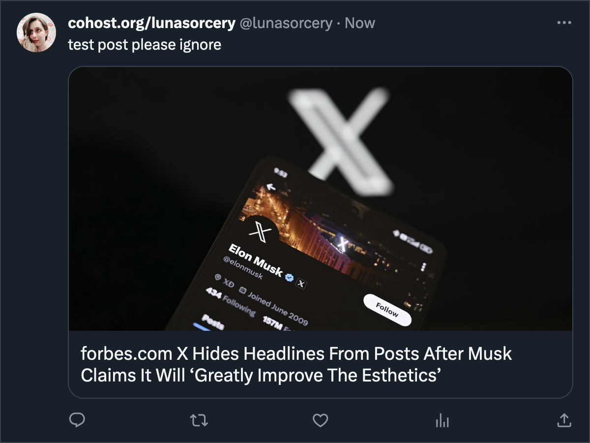

# Twitter Headline Unhider

A set of custom CSS rules to make link-card headlines visible again on Twitter's desktop web interface.

## Demo

**Before:**

**After:**

## Installation

### Step 1: Install a browser extension to inject custom CSS

This style works best with [Stylus](https://github.com/openstyles/stylus) (Chrome/Firefox/Opera) or [Cascadea](https://cascadea.app/) (macOS Safari).

There's also the popular **Stylish** (Chrome/Firefox/Opera), but there are [compelling reasons against using it](https://robertheaton.com/2018/08/16/stylish-is-back-and-you-still-shouldnt-use-it/) — Stylus was created as a safer alternative after that fiasco.

### Step 2: Install the custom CSS

#### Using Stylus

With Stylus installed, click the above button, and the extension will open a new tab prompting you to add the style:

Then, click the "Install style" button on the left, and you're all set!

#### Using Cascadea

With Cascadea installed, click the above button, and the extension will prompt you to add the style:

Click "Yes", and you're all set!
